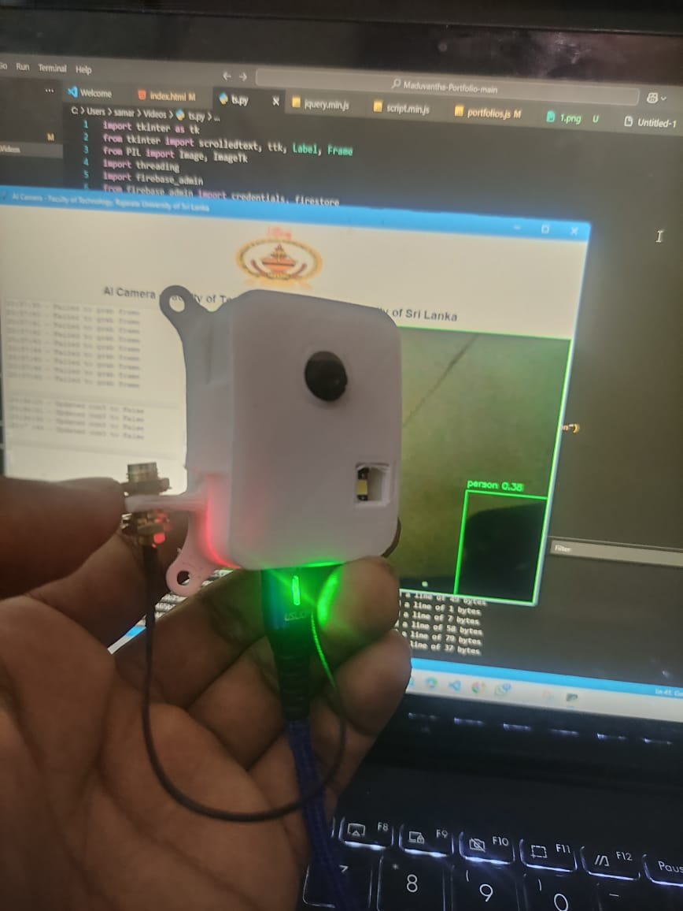
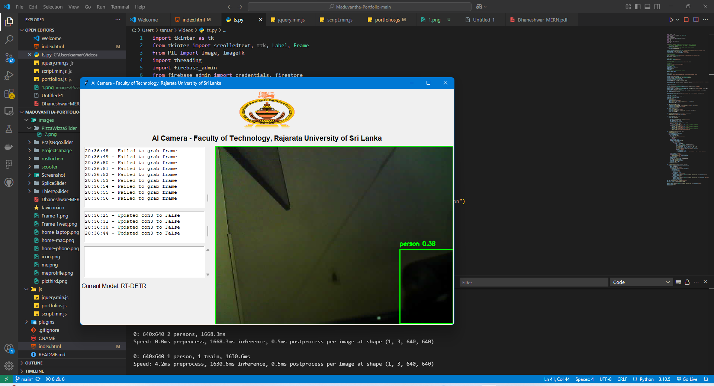
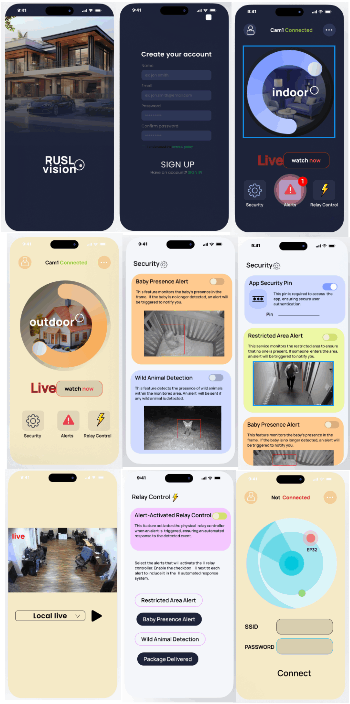

### 🛡️ **Intelligent Surveillance System**  

#### **📌 System Design & Architecture**  

This project is a **real-time surveillance system** designed to integrate AI-powered object detection with smart security controls. It leverages **ESP32-CAM, YOLOv8, cloud computing, and mobile applications** to create an intelligent security solution.  

---
## Screenshots & Images

The system architecture is based on the **integration of hardware and software components** to ensure seamless real-time surveillance.  

### **🔹 Key Components**  
- **📷 ESP32-CAM Module** – A low-power microcontroller with an integrated **2MP camera** for video capture.  
- **🧠 YOLOv8 Object Detection Model** – Embedded AI model for real-time **object detection and classification**.  
- **☁️ Cloud Server** – Manages **storage, live streaming**, and **access control**.  
- **📱 Mobile Application (Flutter)** – Provides user access to live feeds, controls, and security alerts.  
- **⚡ Relay Module** – Controls external devices like **lights or alarms** based on AI detection or user input.  

The system processes involve a seamless interaction between **hardware, AI processing, and cloud-based services** to ensure effective security monitoring.  

📌 **Process Flow:**  
1️⃣ **Camera captures video feed**.  
2️⃣ **YOLOv8 analyzes video frames** and detects objects.  
3️⃣ **System sends alerts** if a security event is detected.  
4️⃣ **Relay module triggers** security devices (lights/alarms).  
5️⃣ **Live feed & recorded footage** are sent to the cloud.  
6️⃣ **User receives notifications** via the mobile app.  

---
## 🔗 **Project Documentation**  
📄 **Final Project Report (PDF):** [Download Here](https://github.com/samaraEdirisooriya/Mobile-App-for-Rusl-Ai-cam/blob/main/Revised%20Final%20Report_GroupNo01.pdf)  

## 🔗 **GitHub Repository**  
🌐 [Your Repository Link](#)  

*(Feel free to add badges, GIFs, or setup instructions for more engagement!)* 🚀
